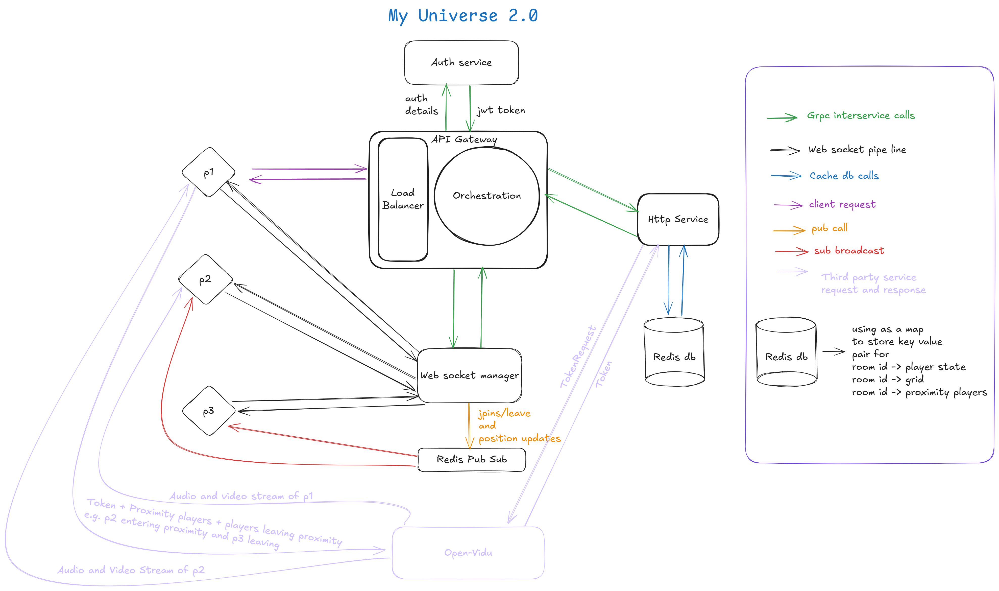

# 🌌 My Universe
My Universe is a real-time, multiplayer virtual space where users interact, collaborate, and move freely as unique avatars. Leveraging scalable design, advanced WebRTC video, and instant proximity-based networking, it’s built to handle both creativity and community—at scale.

## 🚀 Features
Live Multiplayer World:
Effortlessly connect with others in a shared digital universe, with instant audio/video chat based on proximity.

- Real-Time Movement & Interaction:
  Explore, move, and join conversations seamlessly—just approach any group or individual on the map.

- Blazing Fast Proximity Detection:
  Experience near-instant connection/disconnection as you move, powered by intelligent spatial lookup.

- Future-Proof:
  Built with the latest web technology stack (Spring Boot, WebRTC, Web Sockets).

## ⚡ Performance: From O(n²) to O(1) Proximity Lookups
Large multiplayer environments typically struggle with player proximity detection. The naive way checks every player against every other player (O(n^2))—which grinds to a halt as the universe grows.

### My Universe uses a clever solution:

<u>Geohashing for Fast Spatial Indexing</u>

<b>What is Geohashing?</b>

- Geohashing encodes two-dimensional coordinates (x, y) into short, unique strings—the geohashes.
- The space is divided into a grid, and each cell gets a code. Players within the same or adjacent geohash are spatially near each other.
- Nearby players are located by comparing geohashes—much faster than comparing all coordinates directly.

<b>How it Works in My Universe</b>

1. Grid Encoding:
   - Every player’s position is transformed into a geohash at a chosen precision (grid size).

2. Instant Lookup:
   - To find all players within a certain proximity, the system only needs to look at players sharing the same geohash (and in neighboring geohashes for boundaries).
   - Instead of “find my neighbors by scanning everyone” (O(n)), it’s a direct lookup (O(1)).

3. Efficient Updates:
   On every player movement:
   - If the geohash changes, connections/disconnections are recalculated just for their own and neighboring cells.
   - Massively reduces CPU and network load, letting the universe scale to hundreds or thousands of simultaneous users.

4. Result:
   - Dramatic reduction in server and network computation, enabling real real-time interaction, even at massive scale!

<b>Visualization Example</b>
- Old way:
  - Player A moves → check every player: “Am I near A?”
  - Expensive as user count grows.

- Geohash way:
  - Player A moves → “Which cell am I in now? Who’s in this/neighboring cell?”
  - Direct, tiny, constant-time lookup.
 
## 🛠️ Tech Stack
Backend: Spring Boot, Websockets

Real-Time video: OpenVidu / WebRTC

Frontend: Vanilla JS, WebSockets

Storage: MySQL

## 🌟 Future Work
- AI-Generated Avatars:
  Personalized avatars using generative AI! Users will soon create a unique virtual presence with automatically styled characters—no two the same.
- Rich World Customization:
  More creative tools for world-building and avatar interaction.
- Scalable architecture:
  
